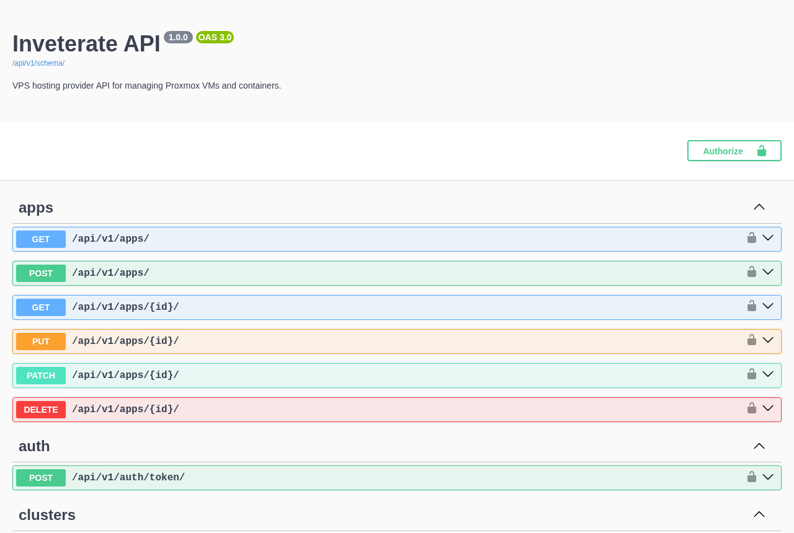
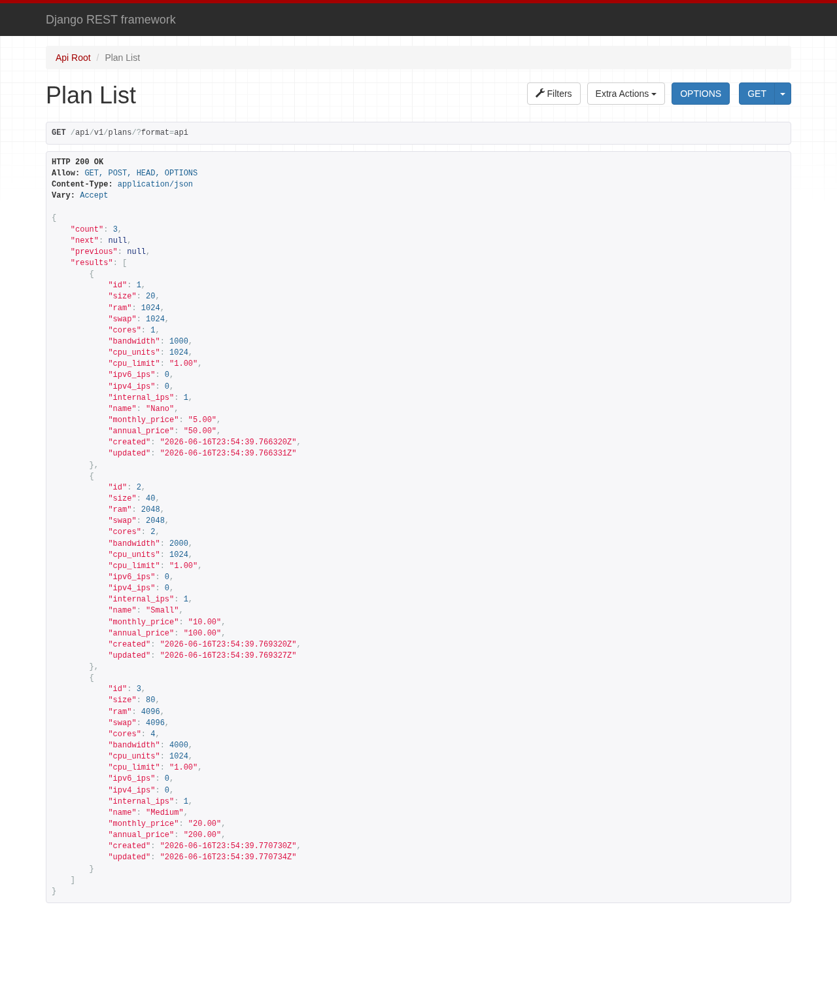

# Inveterate

[](https://pypi.org/project/django-inveterate/)
[](https://pypi.org/project/django-inveterate/)
[](LICENSE.txt)

**An open-source Proxmox provisioning engine for VPS & game-server hosts.**
Inveterate is a Django app that turns a Proxmox cluster into a REST API: spin up
KVM/LXC instances from cloud-init, hand customers a browser console, meter their
bandwidth, and manage IPs and NAT port-forwarding — all in ~15 seconds per deploy.



## Try it in 60 seconds

No Proxmox required to look around — `docker compose up` boots the full stack
(Postgres + Redis + Django + Celery) and seeds a demo catalog of plans, OS
templates, and app profiles:

```bash
git clone https://github.com/hosler/inveterate.git
cd inveterate
cp .env.example .env
docker compose up -d --build
```

Then open:

| URL | What |
|-----|------|
| <http://localhost:8000/api/v1/docs/> | Swagger UI — every endpoint, try-it-out |
| <http://localhost:8000/api/v1/plans/> | Browsable API with the seeded catalog |
| <http://localhost:8000/admin/> | Django admin — log in with `admin` / `admin` |



To actually provision VMs, point it at a Proxmox cluster (see
[Connecting Proxmox](#connecting-proxmox) below).

## Features

- **VM/LXC Provisioning** — automated cloud-init provisioning, cross-node cloning, resource management
- **App Profiles** — pre-configured cloud-init templates (Docker, Nginx, …) selectable at deploy time
- **Browser Console** — terminal in the browser via a WebSocket proxy to Proxmox VNC
- **Networking** — IP pool management, NAT port-forwarding via Nginx Proxy Manager, domain routing with SSL
- **Inventory** — automatic capacity calculation per plan/node (CPU, RAM, disk, IPs, bandwidth)
- **Bandwidth Metering** — per-service usage tracking with monthly renewal and overage suspension
- **SSH Keys** — deploy and update keys on running KVM services via cloud-init
- **Multi-Cluster** — manage multiple Proxmox clusters from one installation

## Connecting Proxmox

Set the Proxmox variables in `.env`, then create the cluster record:

```bash
# .env
PROXMOX_HOST=pve.example.com
PROXMOX_USER=root@pam
PROXMOX_KEY=your-api-token-value

docker compose exec web python manage.py init_cluster
```

From there, add nodes, IP pools, and templates via the admin or API, then `POST
/api/v1/services/` to provision. See the Swagger docs for the full surface.

## Use as a Django app

Inveterate is packaged as `django-inveterate` and can be embedded in an existing
Django project instead of run standalone:

```bash
pip install django-inveterate
```

```python
# settings.py
INSTALLED_APPS = [
    ...
    "inveterate",
]

# urls.py
urlpatterns = [
    path("api/v1/", include("inveterate.urls")),
]
```

It requires Postgres, Redis, and a Celery worker. The optional extras pull in
what each surface needs: `django-inveterate[docs]` (Swagger), `[cors]`,
`[websocket]` (browser console), or `[all]`.

## API Reference

### Public (anonymous)
| Endpoint | Method | Description |
|----------|--------|-------------|
| `/plans/` | GET | List available plans |
| `/templates/` | GET | List OS templates |
| `/apps/` | GET | List app profiles |
| `/inventory/` | GET | Available capacity per plan/node |

### Customer (authenticated)
| Endpoint | Method | Description |
|----------|--------|-------------|
| `/services/` | GET/POST | List or create services |
| `/services/{id}/` | GET | Service detail |
| `/services/{id}/{start,shutdown,stop,reboot,cancel}/` | POST | Power / lifecycle actions |
| `/services/{id}/status/` | POST | Live VM status |
| `/services/{id}/console/` | GET | Console credentials |
| `/services/{id}/ssh_keys/` | POST | Update SSH keys |
| `/portforwards/` | GET/POST/DELETE | CRUD NAT port-forward rules |
| `/domainroutes/` | GET/POST/DELETE | CRUD domain routes |
| `/tasks/{task_id}/` | GET | Poll async task status |

### Admin
Full CRUD on clusters, nodes, node disks, IP pools, IPs, services, plans,
templates, and app profiles. Full interactive reference at `/api/v1/docs/`.

## Scheduled Tasks

Configure these periodic tasks via `django-celery-beat` (the `beat` service in
the compose file runs the scheduler):

| Task | Interval | Description |
|------|----------|-------------|
| `inveterate.tasks.meter_bandwidth` | 5–15 min | Track VM bandwidth usage |
| `inveterate.tasks.calculate_inventory` | 1 hour | Update available capacity |
| `inveterate.tasks.cleanup_console_users` | Daily | Remove orphaned Proxmox console users |
| `inveterate.tasks.cleanup_orphaned_ips` | Daily | Release IPs from destroyed services |

## Production

The included `Dockerfile` runs Gunicorn (gevent worker) by default. Run the web,
`celery`, and `beat` services behind a reverse proxy, set a real `SECRET_KEY`,
a generated `FIELD_ENCRYPTION_KEY`, and `DJANGO_SETTINGS_MODULE=config.settings.production`.

## Built With

[Django](https://www.djangoproject.com/) + [Django REST Framework](https://www.django-rest-framework.org/) ·
[Celery](https://docs.celeryq.dev/) ·
[proxmoxer](https://github.com/proxmoxer/proxmoxer) · PostgreSQL · Redis

## License

Inveterate is licensed under the **GNU AGPLv3** (see [`LICENSE.txt`](LICENSE.txt)).
You can self-host it freely, including to run your own hosting business, as long
as you comply with the AGPL's network-source-disclosure terms. A separate
**commercial license** is available for proprietary / closed-source use — see
[`COMMERCIAL.md`](COMMERCIAL.md).
